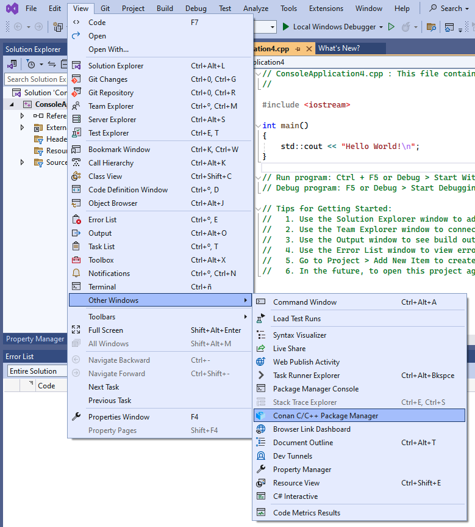

# Conan Visual Studio Extension

Conan, the C and C++ package manager, is now directly integrated into your IDE. List
available libraries, install, and use them without leaving Visual Studio.

## Using the Extension

> **Note**
> 
> For a detailed explanation of how to use the extension, please visit [our documentation
> page](https://docs.conan.io/2/).

After installing the Conan extension, you can access it from the “Conan” tool window in
Visual Studio. To do so, go to **View > Other Windows > Conan C/C++ Package Manager**.

#### Initial Configuration

Initially, you will need to configure the Conan executable to be used by the extension. By
clicking on the ⚙️ (wheel) symbol from the extension's window, you can set up the path to
the Conan client executable. You can either specify a custom path or choose to use the
Conan client installed at the system level.

Once you have configured the Conan client, the extension is ready to use, and you can
start adding libraries to your project.

#### Searching and Adding Libraries

Once configured, the library list in the Conan tool window becomes active, and you can
search for Conan packages using the search bar. Selecting a library will allow you to view
its details, including available versions and integration options.

If you now click the `Add requirement` button, the extension will add a `conanfile.py` and
a `conandata.yml` to your project with the necessary information to install the selected
Conan packages. It will also add a prebuild event to the project to install those
libraries on the next compilation of the project.

At any point, you can also use the refresh button (🔄) to update the list of available
packages in [Conan Center](https://conan.io/center) and the view (👁️) button to check the
requirements that have been added to the project.

Now, if you initiate the build process for your project, the pre-build event will trigger Conan to install the packages and inject the necessary properties into the project, enabling Visual Studio to compile and link against those libraries.

> ⚠️ **Warning**: The initial compilation might fail if Visual Studio does not have sufficient time to process the injected properties. If this happens, simply rebuild the project, and it should build successfully.

## Installation

The Conan Visual Studio Extension can be installed directly from within Visual Studio:

- Open the Extensions menu.
- Select Manage Extensions.
- Search for "Conan" in the Online marketplace.
- Download and install the extension.

Alternatively, you can download the latest release from our [releases
page](https://github.com/conan-io/conan-vs-extension/releases/latest) and install it
manually.

If you have any questions or issues, please refer to our
[documentation](https://docs.conan.io/) or open an issue on our [GitHub
repository](https://github.com/conan-io/conan-vs-extension).
